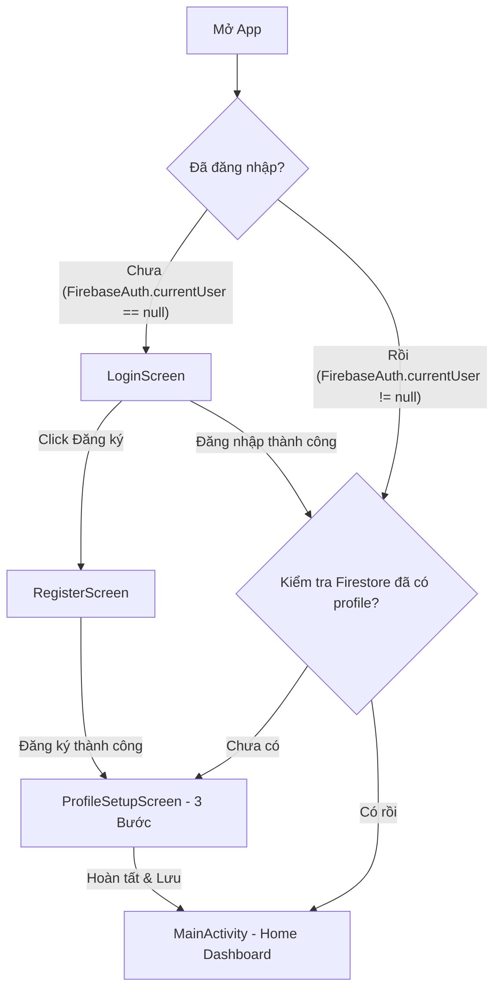

# BÁO CÁO CHI TIẾT MODULE 1: ĐĂNG NHẬP & THIẾT LẬP THỂ TRẠNG
## 📱 Dự án: Ứng dụng Quản lý Dinh dưỡng Cá nhân với AI (Smart Nutrition)
---

> [!IMPORTANT]
> **Vai trò của Module 1 trong dự án**: Đây là module nền tảng **bắt buộc phải hoàn thành đầu tiên**. Nó quản lý định danh người dùng (`UID`) từ Firebase Auth và cung cấp các chỉ số thể trạng cốt lõi (Calories Target, Macros) cho tất cả các module còn lại (Pantry, AI Meal Planner, Habit Tracker, Analytics) truy vấn và sử dụng.

> [!TIP]
> **Thư mục lưu trữ mã nguồn riêng**: Toàn bộ mã nguồn liên quan đến Module 1 đã được sao chép và đóng gói vào thư mục [module1_code](file:///d:/code_github/LapTrinhMobile/module1_code) tại thư mục gốc của dự án. Bạn có thể sử dụng thư mục này để nén (zip) gửi nộp bài hoặc mở xem nhanh các file code.

---

## 1. TỔNG QUAN VÀ PHÂN CÔNG CỦA THÀNH VIÊN 1

*   **Tên Module**: Auth & Profile Setup (Đăng nhập & Thiết lập thể trạng).
*   **Độ khó**: ⭐⭐ (Dễ/Trung bình).
*   **Thành viên phụ trách**: Thành viên 1.
*   **Mục tiêu chính**:
    1.  Xác thực danh tính người dùng bảo mật và thuận tiện.
    2.  Thiết lập hồ sơ thể trạng cơ bản, từ đó tính toán tự động và chính xác mục tiêu năng lượng và dinh dưỡng hàng ngày (chạy local trên app).
    3.  Lưu trữ dữ liệu đồng bộ đám mây và hoạt động offline (Offline-first).
    4.  Cung cấp chức năng ghi chép cân nặng hàng ngày để theo dõi sự biến động (weight logging).

---

## 2. DANH SÁCH MÀN HÌNH (SCREENS) VÀ LUỒNG ĐI (FLOW)

Module sử dụng **Jetpack Compose** kết hợp với **Material Design 3** đem lại giao diện hiện đại và mượt mà.

### 2.1 Danh sách màn hình UI
1.  **LoginScreen**: Form đăng nhập bằng Email/Password + Nút đăng nhập nhanh bằng Google + Nút chuyển sang Đăng ký.
2.  **RegisterScreen**: Form đăng ký (Email, Mật khẩu có xác thực độ mạnh, Xác nhận mật khẩu).
3.  **ProfileSetupScreen**: Giao diện Wizard 3 bước (chỉ hiện 1 lần duy nhất sau khi đăng ký tài khoản mới):
    *   **Bước 1 (Thông tin cơ bản)**: Tên hiển thị, Giới tính, Năm sinh (dùng Slider + Ô nhập).
    *   **Bước 2 (Chỉ số cơ thể)**: Chiều cao, Cân nặng (Slider + Ô nhập) $\rightarrow$ Xem trước chỉ số BMI tức thời.
    *   **Bước 3 (Mục tiêu & Vận động)**: Chọn mục tiêu (Giảm cân, Tăng cơ, Duy trì) + Mức độ vận động (5 cấp độ) $\rightarrow$ Hiển thị toàn bộ kết quả tính toán (BMI, BMR, TDEE, Target Calories, Macros).
4.  **ProfileViewScreen**: Xem và cập nhật thông tin cá nhân.
5.  **WeightLogScreen**: Cho phép người dùng nhập cân nặng hôm nay, tự động cập nhật lại BMI và xem danh sách lịch sử cân nặng (sắp xếp giảm dần theo ngày).

### 2.2 Luồng hoạt động (User Flow)


---

## 3. DANH SÁCH CHI TIẾT CÁC FILE CODE & CLASS TRONG MODULE 1

Toàn bộ các file nằm trong package `com.team.smartnutrition.auth`.

```
com.team.smartnutrition.auth/
│
├── data/
│   └── UserRepository.kt            (Tầng Data - Quản lý Firebase Auth + Firestore)
│
├── model/
│   └── User.kt                      (Data model đại diện User profile và Weight log)
│
├── util/
│   ├── HealthCalculator.kt          (Utility chứa toàn bộ công thức tính chỉ số sức khỏe)
│   └── Validators.kt                (Utility xác thực định dạng Email/Password đầu vào)
│
├── viewmodel/
│   ├── LoginViewModel.kt            (Quản lý State và xử lý logic Đăng nhập)
│   ├── RegisterViewModel.kt         (Quản lý State và xử lý logic Đăng ký)
│   ├── ProfileSetupViewModel.kt     (Quản lý State và xử lý luồng wizard 3 bước)
│   ├── ProfileViewViewModel.kt      (Quản lý State và xử lý cập nhật profile)
│   └── WeightLogViewModel.kt        (Quản lý State và xử lý nhật ký cân nặng)
│
└── (Screens - Jetpack Compose UI)
    ├── LoginScreen.kt               (UI Đăng nhập)
    ├── RegisterScreen.kt            (UI Đăng ký)
    ├── ProfileSetupScreen.kt        (UI Thiết lập thể trạng 3 bước)
    ├── ProfileViewScreen.kt         (UI Xem/Sửa Profile)
    └── WeightLogScreen.kt           (UI Nhật ký cân nặng)
```

---

### 3.1 Nhóm 1: Tầng dữ liệu (Model & Data Repository)

#### 3.1.1 Class `User` & `WeightEntry` (trong file `User.kt`)
*   **Mục đích**: Ánh xạ dữ liệu trực tiếp 1:1 với tài liệu Firestore.
*   **Class `User`**:
    *   `uid: String`: Mã định danh người dùng từ Firebase Auth.
    *   `email: String`: Địa chỉ email.
    *   `displayName: String`: Tên hiển thị người dùng nhập vào.
    *   `gender: String`: Giới tính (`"male"` | `"female"`).
    *   `birthYear: Int`: Năm sinh (dùng để tính tuổi).
    *   `heightCm: Int`: Chiều cao (cm).
    *   `weightKg: Double`: Cân nặng hiện tại (kg).
    *   `activityLevel: Double`: Hệ số vận động ($1.2 \rightarrow 1.9$).
    *   `goal: String`: Mục tiêu sức khỏe (`"lose_weight"` | `"maintain"` | `"gain_muscle"`).
    *   `bmi: Double`, `bmr: Double`, `tdee: Double`: Các chỉ số thể chất.
    *   `proteinTarget: Int`, `carbTarget: Int`, `fatTarget: Int`: Lượng Macros mục tiêu (gram/ngày).
    *   `calorieTarget: Int`: Lượng calo cần nạp hàng ngày (kcal/ngày).
    *   `createdAt: Timestamp?`, `updatedAt: Timestamp?`: Thời gian tạo và cập nhật.
*   **Class `WeightEntry`**: Đại diện cho 1 lần ghi nhận cân nặng trong sub-collection `weightLog`.
    *   `weightKg: Double`: Cân nặng được ghi nhận.
    *   `bmi: Double`: Chỉ số BMI tính lại dựa trên cân nặng mới này.
    *   `loggedAt: Timestamp?`: Ngày giờ ghi nhận.
    *   `date: String`: Định dạng `yyyy-MM-dd` (Đồng thời là Document ID).

#### 3.1.2 Class `UserRepository` (trong `UserRepository.kt`)
*   **Mục đích**: Đóng gói các phương thức của Firebase SDK.
*   **Các thuộc tính**:
    *   `auth = FirebaseAuth.getInstance()`
    *   `firestore = FirebaseFirestore.getInstance()`
*   **Các phương thức chính**:
    *   `signInWithEmail(email, password)`: Xác thực email/password.
    *   `signInWithCredential(credential)`: Đăng nhập Google (dùng Credential Manager).
    *   `registerWithEmail(email, password)`: Tạo tài khoản mới.
    *   `signOut()`: Đăng xuất người dùng.
    *   `hasProfile(uid)`: Kiểm tra xem user có document trong collection `users` chưa.
    *   `getUser(uid)`: Lấy dữ liệu user hiện tại.
    *   `saveUser(user)`: Lưu/Cập nhật profile user lên Firestore.
    *   `logWeight(uid, date, weight, bmi)`: Ghi nhận cân nặng mới (sử dụng **Batch Write** để ghi đè vào sub-collection `weightLog` đồng thời update trường `weightKg` và `bmi` ở user document gốc).
    *   `getWeightHistory(uid, limit)`: Lấy danh sách lịch sử cân nặng từ `weightLog`, sắp xếp giảm dần theo thời gian.

---

### 3.2 Nhóm 2: Lớp nghiệp vụ & Tính toán (Utility Classes)

#### 3.2.1 Object `HealthCalculator` (trong `HealthCalculator.kt`)
*   **Mục đích**: Tính toán toàn bộ các chỉ số sức khỏe bằng các hàm thuần khiết (pure functions) chạy trực tiếp tại client.
*   **Các phương thức chính**:
    *   `calculateBmi(weightKg, heightCm)`: Trả về chỉ số BMI ($Cân nặng / Chiều cao(m)^2$).
    *   `getBmiCategory(bmi)`: Phân loại thể trạng thành "Thiếu cân", "Bình thường", "Thừa cân", "Béo phì".
    *   `calculateBmr(weightKg, heightCm, age, gender)`: Tính BMR theo công thức Harris-Benedict (phân chia nam/nữ).
    *   `calculateTdee(bmr, activityLevel)`: Tính TDEE ($BMR \times activityLevel$).
    *   `calculateCalorieTarget(tdee, goal)`: Điều chỉnh calo đích theo mục tiêu (Giảm mỡ: $-500$ kcal, Tăng cơ: $+300$ kcal, Duy trì: giữ nguyên).
    *   `calculateMacros(calorieTarget, goal)`: Trả về bộ ba giá trị dinh dưỡng đạm/tinh bột/béo (Protein/Carb/Fat) theo tỷ lệ phần trăm năng lượng phù hợp.
    *   `calculateAllMetrics(...)`: Hàm tổng hợp chạy 1 lượt tính hết các chỉ số trên $\rightarrow$ Trả về object `HealthMetrics`.

#### 3.2.2 Object `Validators` (trong `Validators.kt`)
*   **Mục đích**: Kiểm tra tính hợp lệ của dữ liệu người dùng nhập vào Form trước khi gửi lên Firebase.
*   **Các phương thức chính**:
    *   `isValidEmail(email)`: Sử dụng regex mặc định của Android (`Patterns.EMAIL_ADDRESS`).
    *   `isValidPassword(password)`: Kiểm tra mật khẩu có $\ge 6$ ký tự, có ít nhất 1 chữ viết hoa, và ít nhất 1 chữ số.
    *   `doPasswordsMatch(password, confirmPassword)`: Đối chiếu tính trùng khớp.
    *   `getEmailError()`, `getPasswordError()`, `getConfirmPasswordError()`: Trả về chuỗi thông báo lỗi cụ thể hiển thị trực tiếp lên TextField.

---

### 3.3 Nhóm 3: Tầng logic giao diện (ViewModels)

Các ViewModel sử dụng `StateFlow` để phát trạng thái (UI State) đến các Composable UI và sử dụng `viewModelScope` để chạy các tác vụ bất đồng bộ thông qua Kotlin Coroutines.

1.  **LoginViewModel**:
    *   `uiState: StateFlow<LoginUiState>`: Chứa thông tin email, password nhập vào, trạng thái loading, lỗi, định hướng màn hình (`LoginDestination`).
    *   `signInWithEmail()`: Đăng nhập bằng Email/Password.
    *   `signInWithGoogle(activity)`: Kích hoạt Credential Manager lấy Google ID Token và chuyển đổi sang Firebase Credential để đăng nhập Google.
    *   `checkProfileAndNavigate(uid)`: Kiểm tra Firestore profile $\rightarrow$ Chọn điều hướng sang Home hay Setup.
2.  **RegisterViewModel**:
    *   `uiState: StateFlow<RegisterUiState>`: Quản lý form đăng ký và lỗi hiển thị trực quan cho từng trường đầu vào.
    *   `register()`: Gọi repository để tạo tài khoản, nếu thành công đặt trạng thái `isRegistered = true`.
3.  **ProfileSetupViewModel**:
    *   `uiState: StateFlow<ProfileSetupUiState>`: Quản lý biến bước hiện tại (`currentStep`), các dữ liệu nhập ở 3 bước (tên, giới tính, chiều cao, cân nặng, mục tiêu, vận động) và kết quả tính toán `HealthMetrics`.
    *   `nextStep()`, `previousStep()`: Chuyển bước trong giao diện Wizard. Khi chuyển sang bước 3, tự động gọi `recalculateMetrics()` để tính toán.
    *   `saveProfile()`: Tạo đối tượng `User` hoàn chỉnh và lưu lên Firestore thông qua repository.
4.  **ProfileViewViewModel**:
    *   Đọc và hiển thị hồ sơ cá nhân hiện tại.
    *   Cập nhật và tính toán lại toàn bộ chỉ số khi người dùng sửa hồ sơ.
5.  **WeightLogViewModel**:
    *   `uiState: StateFlow<WeightLogUiState>`: Chứa cân nặng nhập mới nhất, BMI tính realtime, danh sách lịch sử `history`.
    *   `saveWeight()`: Thực hiện lưu cân nặng hôm nay qua `repository.logWeight`.
    *   `loadWeightHistory()`: Nạp lịch sử cân nặng từ database.

---

## 4. THUẬT TOÁN VÀ CÔNG THỨC TÍNH TOÁN LOCAL

### 4.1 Chỉ số khối cơ thể (BMI)
$$BMI = \frac{WeightKg}{(HeightCm / 100)^2}$$

### 4.2 Tỷ lệ trao đổi chất cơ bản (BMR) - Công thức Harris-Benedict cải tiến
*   **Nam giới**:
    $$BMR = 88.362 + (13.397 \times WeightKg) + (4.799 \times HeightCm) - (5.677 \times Age)$$
*   **Nữ giới**:
    $$BMR = 447.593 + (9.247 \times WeightKg) + (3.098 \times HeightCm) - (4.330 \times Age)$$

### 4.3 Tổng lượng tiêu hao năng lượng hàng ngày (TDEE)
$$TDEE = BMR \times ActivityLevel$$
*(Activity level tương ứng từ 1.2 đến 1.9)*

### 4.4 Calorie Target (Năng lượng mục tiêu mỗi ngày)
*   **Giảm mỡ (`lose_weight`)**: $TDEE - 500\text{ kcal}$
*   **Tăng cơ (`gain_muscle`)**: $TDEE + 300\text{ kcal}$
*   **Duy trì cân nặng (`maintain`)**: Giữ nguyên $TDEE$.

### 4.5 Macros Target (Tỷ lệ đạm, tinh bột, chất béo)
*   **Tăng cơ**: 30% Protein (4 kcal/g), 45% Carb (4 kcal/g), 25% Fat (9 kcal/g).
*   **Giảm mỡ**: 35% Protein, 35% Carb, 30% Fat.
*   **Duy trì**: 25% Protein, 50% Carb, 25% Fat.

---

## 5. CẤU TRÚC FIRESTORE DATABASE (SCHEMA)

### 5.1 Document User: `users/{uid}`
```json
{
  "uid": "1hF3Hj...",
  "email": "user@gmail.com",
  "displayName": "Nguyễn Văn A",
  "gender": "male",
  "birthYear": 2003,
  "heightCm": 170,
  "weightKg": 65.5,
  "activityLevel": 1.55,
  "goal": "lose_weight",
  "bmi": 22.66,
  "bmr": 1632.5,
  "tdee": 2530.4,
  "proteinTarget": 130,
  "carbTarget": 280,
  "fatTarget": 70,
  "calorieTarget": 2024,
  "createdAt": "2026-06-30T17:00:00Z",
  "updatedAt": "2026-07-01T01:00:00Z"
}
```

### 5.2 Collection Nhật ký Cân nặng: `users/{uid}/weightLog/{date}`
*   **Document ID**: Định dạng `yyyy-MM-dd` (Ví dụ: `2026-07-01`).
```json
{
  "weightKg": 65.2,
  "bmi": 22.56,
  "loggedAt": "2026-07-01T08:30:00Z"
}
```

---

## 6. HƯỚNG DẪN TRẢ LỜI CÁC CÂU HỎI CHỈNH SỬA CODE & LUỒNG HOẠT ĐỘNG (Q&A CHO HỘI ĐỒNG)

Đây là các câu hỏi phổ biến nhất mà các thầy cô thường hỏi liên quan đến code và lập trình.

### ❓ Câu 1: "Thầy muốn thêm một trường mới vào hồ sơ sức khỏe, ví dụ dị ứng thực phẩm (`allergies`) hoặc bệnh nền (`medicalConditions`), em cần sửa những file nào và sửa ra sao?"
*   **Trả lời**: Để thêm trường mới, chúng ta cần sửa qua 4 tầng code:
    1.  **Tầng Model (`User.kt`)**: Khai báo thêm biến trong data class `User` (ví dụ: `val medicalConditions: String = ""`).
    2.  **Tầng UI State & ViewModel (`ProfileSetupViewModel.kt`)**: 
        *   Thêm biến `medicalConditions: String` vào data class `ProfileSetupUiState`.
        *   Tạo hàm cập nhật `fun updateMedicalConditions(text: String)` trong ViewModel để cập nhật State.
        *   Trong hàm `saveProfile()`, bổ sung trường `medicalConditions = state.medicalConditions` vào hàm dựng đối tượng `User` trước khi truyền sang Repository.
    3.  **Tầng Data (`UserRepository.kt`)**: Trong hàm `saveUser(user: User)`, bổ sung cặp khóa-giá trị `"medicalConditions" to user.medicalConditions` vào đối tượng HashMap để đẩy lên Firestore.
    4.  **Tầng UI (`ProfileSetupScreen.kt`)**: Tạo thêm một Composable TextField ở bước 3 (hoặc tạo thêm bước mới) để người dùng gõ/chọn thông tin bệnh nền, liên kết sự kiện `onValueChange` với hàm `viewModel.updateMedicalConditions(it)`.

---

### ❓ Câu 2: "Hiện tại quy tắc mật khẩu tối thiểu là 6 ký tự, có 1 chữ hoa, 1 chữ số. Nếu thầy muốn đổi thành: tối thiểu 8 ký tự, bắt buộc có ít nhất 1 ký tự đặc biệt (như @, #, $,...) thì em sửa ở đâu?"
*   **Trả lời**: Logic xác thực định dạng đầu vào được gom gọn hoàn toàn trong lớp tiện ích `Validators.kt`. Chúng ta chỉ cần chỉnh sửa tại đây mà không cần đụng đến UI hay ViewModel:
    1.  Mở file `Validators.kt`.
    2.  Tìm hàm `isValidPassword(password: String)` và cập nhật điều kiện:
        ```kotlin
        fun isValidPassword(password: String): Boolean {
            val specialChars = setOf('@', '#', '$', '%', '^', '&', '*', '!', '_', '-')
            return password.length >= 8 && // Đổi từ 6 lên 8
                    password.any { it.isUpperCase() } &&
                    password.any { it.isDigit() } &&
                    password.any { it in specialChars } // Thêm điều kiện ký tự đặc biệt
        }
        ```
    3.  Tìm hàm `getPasswordError(password: String)` để cập nhật các câu thông báo lỗi tương ứng trả về cho giao diện (ví dụ đổi thành: "Mật khẩu phải có ít nhất 8 ký tự" và thêm thông báo "Cần ít nhất 1 ký tự đặc biệt").

---

### ❓ Câu 3: "Khi người dùng ấn nút đăng nhập bằng Google trên màn hình UI, luồng code chạy qua những đâu để đăng nhập thành công?"
*   **Trả lời**: Luồng hoạt động chi tiết gồm các bước:
    1.  **UI (`LoginScreen.kt`)**: Người dùng click nút Google $\rightarrow$ UI gọi `context.findActivity()` để lấy context hiện tại và gọi `viewModel.signInWithGoogle(activity)`.
    2.  **ViewModel (`LoginViewModel.kt`)**: Chạy coroutine `viewModelScope.launch` gọi `CredentialManager` của hệ thống để hiển thị BottomSheet tài khoản Google của Android. Khi người dùng chọn tài khoản $\rightarrow$ Credential Manager trả về `GoogleIdTokenCredential` chứa chuỗi `idToken`.
    3.  **Chuyển đổi Credential**: ViewModel dùng `GoogleAuthProvider.getCredential(idToken, null)` để chuyển đổi ID Token của Google sang đối tượng `AuthCredential` phù hợp với Firebase.
    4.  **Repository (`UserRepository.kt`)**: ViewModel gọi `repository.signInWithCredential(credential)` $\rightarrow$ Repository thực hiện xác thực với Firebase SDK qua `.signInWithCredential(credential).await()` và trả về đối tượng `FirebaseUser`.
    5.  **Điều hướng**: Trở lại ViewModel, hàm `checkProfileAndNavigate(uid)` được kích hoạt. Nó kiểm tra xem UID này đã tồn tại trong collection `users` trên Firestore chưa. Nếu có $\rightarrow$ đặt trạng thái hướng đến là `LoginDestination.HOME`. Nếu chưa $\rightarrow$ chuyển hướng đến `LoginDestination.PROFILE_SETUP`.

---

### ❓ Câu 4: "Tại sao trong hàm lưu cân nặng (`logWeight`) ở UserRepository, em lại sử dụng Batch Write mà không ghi lần lượt? Code cụ thể chạy ra sao?"
*   **Trả lời**: 
    1.  *Lý do*: Khi người dùng cập nhật cân nặng mới, chúng ta cần ghi nhận nó vào **hai nơi khác nhau** trên Firestore: một bản ghi lịch sử ở sub-collection `users/{uid}/weightLog/{date}` và cập nhật trực tiếp hai trường `weightKg` và `bmi` tại document của user đó (`users/{uid}`) để các chức năng khác đọc được ngay lập tức. Nếu ghi lần lượt bằng 2 lệnh riêng biệt, khi mạng chập chờn hoặc có lỗi xảy ra, có thể lệnh 1 thành công nhưng lệnh 2 thất bại $\rightarrow$ dẫn đến dữ liệu không nhất quán.
    2.  *Cơ chế Batch Write*: Firebase Firestore cung cấp Batch Write để gộp các thao tác ghi lại thành một khối giao dịch nguyên tử (Atomic). 
    3.  *Giải thích Code*:
        ```kotlin
        val batch = firestore.batch()
        // 1. Tạo tham chiếu và nạp lệnh ghi cân nặng ngày hôm nay
        val weightRef = firestore.collection("users").document(uid)
            .collection("weightLog").document(date)
        batch.set(weightRef, entry)

        // 2. Tạo tham chiếu và nạp lệnh cập nhật cân nặng & bmi tại user profile
        val userRef = firestore.collection("users").document(uid)
        batch.update(userRef, mapOf(
            "weightKg" to weightKg,
            "bmi" to bmi,
            "updatedAt" to Timestamp.now()
        ))

        // 3. Thực hiện commit toàn bộ batch. Cả hai ghi thành công hoặc cùng thất bại
        batch.commit()
        ```

---

### ❓ Câu 5: "Lớp `HealthCalculator` là class thông thường hay là gì? Tại sao em khai báo là `object`?"
*   **Trả lời**: Trong Kotlin, `object` định nghĩa một lớp Singleton (chỉ có duy nhất một thực thể trong suốt vòng đời ứng dụng). Lớp `HealthCalculator` chỉ chứa các hàm tiện ích tính toán (hàm static helper), không lưu trữ trạng thái (state-less) của một đối tượng cụ thể nào. Việc dùng `object` giúp chúng ta gọi trực tiếp các phương thức như `HealthCalculator.calculateBmi(...)` từ bất kỳ đâu mà không cần tốn bộ nhớ khởi tạo đối tượng mới (không cần dùng từ khóa `new` như Java).
