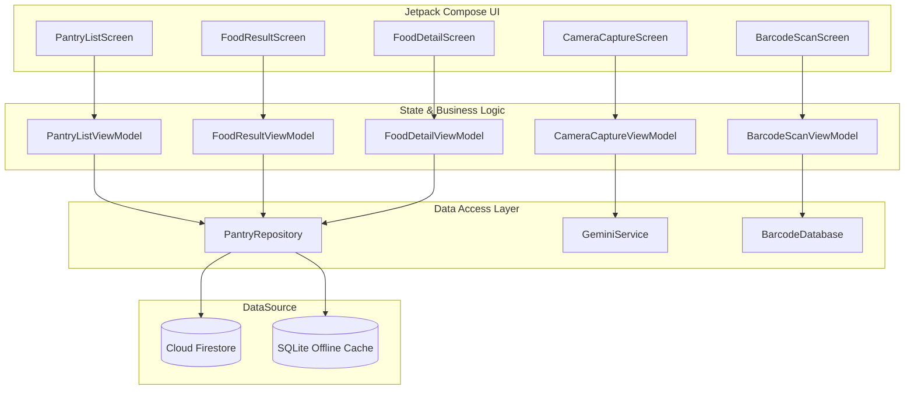

# BÁO CÁO CHI TIẾT: MODULE 2 — PANTRY SCANNER & INVENTORY

## 1. TỔNG QUAN HỆ THỐNG & KIẾN TRÚC (MVVM)

Module 2 phụ trách **quản lý kho thực phẩm (Pantry)** của người dùng, tích hợp các công nghệ phần cứng và AI tiên tiến:
*   **CameraX API**: Hỗ trợ chụp ảnh thực phẩm (Camera AI) và truyền luồng ảnh phân tích mã vạch.
*   **Gemini Vision API (SDK `generativeai`)**: Nhận diện hình ảnh thực phẩm tươi sống, trả về lượng Calo và Protein ước tính.
*   **Google ML Kit Barcode Scanning**: Phân tích luồng hình ảnh thời gian thực để quét mã vạch EAN-13 của thực phẩm đóng hộp.
*   **Firebase Firestore Offline Persistence**: Đồng bộ hóa dữ liệu kho 2 chiều thời gian thực (realtime) hỗ trợ ngoại tuyến hoàn toàn.

Kiến trúc tuân thủ nghiêm ngặt mô hình **MVVM (Model-View-ViewModel)** phối hợp với Repository Pattern:



### Luồng Dữ Liệu Chi Tiết:
1.  **Quét mã vạch (Barcode Scan)**: 
    *   `BarcodeScanScreen` dùng CameraX phân tích khung hình → Truyền sang ML Kit `BarcodeScanner`.
    *   Phát hiện mã vạch → `BarcodeScanViewModel` tra cứu trong `BarcodeDatabase` (Local HashMap cho Việt Nam).
    *   Nếu khớp: Trả về thông tin thực phẩm dưới dạng bottom sheet. Nếu không khớp: Cho phép người dùng chuyển tới `FoodResultScreen` để tự nhập thông tin thủ công.
2.  **Nhận diện hình ảnh (Camera AI)**:
    *   `CameraCaptureScreen` chụp ảnh bằng CameraX `ImageCapture`.
    *   `CameraCaptureViewModel` gửi Bitmap đã thu gọn (max 1024px) tới `GeminiService`.
    *   `GeminiService` gọi API `gemini-2.5-flash` kèm prompt chuyên biệt trả về cấu trúc JSON.
    *   Parse kết quả thành `FoodRecognitionResult` rồi truyền sang màn hình `FoodResultScreen` bằng `savedStateHandle` của Compose Navigation để người dùng kiểm tra lại và chỉnh sửa trước khi lưu.
3.  **Quản lý kho (Pantry List)**:
    *   `PantryListScreen` lắng nghe `Flow<List<PantryItem>>` từ `PantryRepository` thông qua Snapshot Listener của Firestore.
    *   Trạng thái hết hạn sử dụng (`ExpiryStatus`) được tính toán động ngay trên UI dựa vào ngày hiện tại và ngày hết hạn lưu trên document Firestore.

---

## 2. THUẬT TOÁN & LOGIC CỐT LÕI

### A. Tự động Nén & Điều chỉnh Kích thước Ảnh (Image Optimization)
Để tránh lỗi vượt quá dung lượng request (thường là 4MB) của Gemini API và tiết kiệm băng thông mạng, ảnh Bitmap chụp từ camera được xử lý giảm kích thước thông qua phương thức `resizeBitmap` trong `GeminiService.kt`:

*   **Nguyên lý**: Tìm hệ số tỷ lệ `ratio = minOf(1024 / width, 1024 / height)`.
*   **Thực thi**: Nếu ảnh lớn hơn 1024px ở chiều rộng hoặc chiều cao, ảnh sẽ được nhân với tỉ lệ này để co nhỏ lại mà vẫn giữ nguyên tỉ lệ khung hình (Aspect Ratio), sau đó tạo một bản Bitmap mới thông qua `Bitmap.createScaledBitmap()`.

### B. Kỹ thuật Kỹ sư Prompt (Prompt Engineering) với Gemini
Nhận diện hình ảnh yêu cầu dữ liệu trả về phải có cấu trúc ổn định để ứng dụng Android tự động chuyển đổi thành đối tượng Kotlin (Deserialization).
Prompt được tinh chỉnh nghiêm ngặt trong `GeminiService.kt`:
```kotlin
private const val FOOD_RECOGNITION_PROMPT = """
Bạn là chuyên gia dinh dưỡng. Nhận diện thực phẩm trong ảnh này.
Trả về ĐÚNG 1 JSON object với format sau:
{"name": "tên tiếng Việt", "calories": số kcal trên 100g, "protein": số gram protein trên 100g}

Quy tắc:
- "name": tên thực phẩm bằng tiếng Việt, viết thường, ngắn gọn
- "calories": số nguyên, ước tính kcal trên 100g
- "protein": số nguyên, ước tính gram protein trên 100g
- Chỉ trả JSON thuần, KHÔNG giải thích thêm, KHÔNG wrap trong markdown
"""
```
**Xử lý Ngoại lệ (Robustness)**: Gemini thỉnh thoảng sẽ tự động bao bọc JSON trong khối mã Markdown (ví dụ: ` ```json\n...\n``` `). Do đó, hàm `stripMarkdownWrapper` sẽ loại bỏ các ký tự bọc này trước khi đưa chuỗi JSON vào thư viện `Gson` để parse.

### C. Logic Phân loại Cảnh báo Hạn Sử Dụng (Expiry Alert Logic)
Ứng dụng thực hiện phân loại thực phẩm thành 3 mức độ cảnh báo dựa trên số ngày còn lại đến khi hết hạn sử dụng. Logic được cài đặt tại `ExpiryStatus.kt`:

*   **Tính toán số ngày còn lại**:
    $$\text{days} = \text{ChronoUnit.DAYS.between}(\text{LocalDate.now()}, \text{expiryLocalDate})$$
*   **Quy tắc phân loại**:
    *   🟢 **FRESH (Còn tươi)**: $\text{days} > 3$
    *   🟡 **EXPIRING (Sắp hết hạn)**: $1 \le \text{days} \le 3$
    *   🔴 **EXPIRED (Đã hết hạn)**: $\text{days} \le 0$
*   **Màu sắc hiển thị**: Sử dụng mã hex màu tiêu chuẩn để đồng bộ hóa mã giao diện UI (`#4CAF50` cho xanh, `#FFC107` cho vàng, `#F44336` cho đỏ).

---

## 3. FIRESTORE DATABASE SCHEMA

Mỗi tài khoản có một kho thực phẩm riêng biệt, được tổ chức dưới dạng một **Sub-collection** nằm bên trong document của người dùng.

### Path: `users/{uid}/pantry/{itemId}`

| Field Name | Firestore Data Type | Description | Example / Value |
| :--- | :--- | :--- | :--- |
| **id** | `String` (Document ID) | ID tự động sinh bởi Firestore | `"zX9Y7wK2sLm8N"` |
| **name** | `String` | Tên thực phẩm (tiếng Việt) | `"Ức gà"` |
| **caloriesPer100g** | `Number (Integer)` | Lượng calo trên 100g thực phẩm | `165` |
| **proteinPer100g** | `Number (Integer)` | Lượng protein trên 100g thực phẩm | `31` |
| **quantityGrams** | `Number (Integer)` | Khối lượng/Số lượng thực phẩm | `500` |
| **unit** | `String` | Đơn vị đo lường | `"gram"` \| `"piece"` \| `"ml"` |
| **source** | `String` | Nguồn gốc dữ liệu nhập vào | `"camera"` \| `"barcode"` \| `"manual"` |
| **imageUrl** | `String` | Đường dẫn ảnh chụp (nếu có) | `"https://firebasestorage..."` |
| **barcode** | `String` | Mã vạch EAN-13 nếu quét qua barcode | `"8934673583220"` |
| **expiryDate** | `Timestamp` | Thời điểm hết hạn sử dụng | `Timestamp(seconds=1782877200, nanoseconds=0)` |
| **addedAt** | `Timestamp` | Thời điểm đưa vào kho | `Timestamp.now()` |
| **status** | `String` | Trạng thái đồng bộ (từ ExpiryStatus) | `"fresh"` \| `"expiring"` \| `"expired"` |

---

## 4. CHI TIẾT CÁC LỚP TRONG MODULE 2

### A. Data Layer (`com.team.smartnutrition.pantry.data`)
1.  **`PantryRepository.kt`**:
    *   `addItem(uid, item)`: Thêm tài nguyên mới vào database. Ghi trực tiếp vào SQLite cache local để hỗ trợ ngoại tuyến ngay lập tức.
    *   `getItems(uid)`: Trả về một `Flow<List<PantryItem>>` sử dụng Snapshot Listener, sắp xếp theo thứ tự `expiryDate` tăng dần (thực phẩm sắp hết hạn đứng trước).
    *   `getAvailableItems(uid)`: Lấy các thực phẩm chưa bị hết hạn (cho Module 3 - AI Meal Planner lên thực đơn).
    *   `updateItem(...)` & `deleteItem(...)`: Chỉnh sửa thông tin/xóa thực phẩm.
2.  **`GeminiService.kt`**:
    *   Gọi và quản lý kết nối tới Gemini API. Chuyển đổi tệp ảnh chụp Bitmap thành dữ liệu phân tích dạng JSON.

### B. ViewModel Layer (`com.team.smartnutrition.pantry.viewmodel`)
1.  **`PantryListViewModel.kt`**:
    *   Lắng nghe danh sách thực phẩm từ Repo. Thực hiện bộ lọc tìm kiếm (Search Query) và bộ lọc theo trạng thái hạn dùng (`ExpiryFilter`: ALL, EXPIRING, EXPIRED) trên bộ nhớ (in-memory) để đảm bảo tốc độ phản hồi UI cực nhanh.
2.  **`CameraCaptureViewModel.kt`**:
    *   Quản lý trạng thái luồng camera (quản lý quyền camera `hasCameraPermission`) và trạng thái chờ kết quả phản hồi của AI (`isProcessing`).
3.  **`BarcodeScanViewModel.kt`**:
    *   Quản lý sự kiện quét được mã vạch. Thực hiện đối chiếu mã với `BarcodeDatabase` cục bộ để tìm kiếm thông tin ngay tức thì.
4.  **`FoodResultViewModel.kt`**:
    *   Lưu trữ kết quả tạm thời nhận từ camera/barcode và xử lý sự kiện bấm "Xác nhận" để lưu vào kho thực phẩm Firestore.
5.  **`FoodDetailViewModel.kt`**:
    *   Quản lý thông tin chi tiết của một mặt hàng cụ thể, xử lý logic chỉnh sửa số lượng nhanh (ví dụ: tăng/giảm gam) và cập nhật ngày hết hạn mới.

### C. UI Component Layer (`com.team.smartnutrition.pantry`)
1.  **`PantryListScreen.kt`**:
    *   Màn hình chính. Hiển thị danh sách thực phẩm với các màu sắc trực quan (Xanh/Vàng/Đỏ). Sử dụng `SwipeToDismissBox` của Material3 để vuốt sang trái để xóa một cách trực quan.
2.  **`CameraCaptureScreen.kt`**:
    *   Màn hình camera toàn cảnh bằng CameraX `PreviewView`. Nút chụp kết nối trực tiếp với SDK Gemini.
3.  **`BarcodeScanScreen.kt`**:
    *   Màn hình quét mã vạch thời gian thực. Vẽ khung ngắm (Overlay Scan Window) bằng Canvas Compose và truyền luồng phân tích hình ảnh (Image Analysis) vào thư viện Google ML Kit.
4.  **`FoodResultScreen.kt`**:
    *   Form điền thông tin thực phẩm (tự động điền dữ liệu trả về từ Gemini hoặc Barcode). Người dùng có thể chỉnh sửa lại tên, calo, protein, số lượng và ngày hết hạn.
5.  **`FoodDetailScreen.kt`**:
    *   Màn hình chi tiết thực phẩm. Hiển thị thông số dinh dưỡng chi tiết và cho phép chỉnh sửa nhanh số lượng thực phẩm.

---

## 5. BỘ CÂU HỎI Q&A PHẢN BIỆN (DÀNH CHO BÁO CÁO THẦY CÔ)

### ❓ Câu hỏi 1: Tại sao em lại sử dụng ImageAnalysis của CameraX kết hợp ML Kit mà không chụp ảnh rồi mới quét mã vạch?
*   **Trả lời**: Sử dụng `ImageAnalysis` cho phép ứng dụng phân tích trực tiếp từng khung hình trong luồng xem trước của camera (Camera Preview) với tần suất cao (real-time). Người dùng chỉ cần hướng camera vào mã vạch mà không cần bấm nút chụp, giúp cải thiện trải nghiệm người dùng tối đa. ML Kit xử lý cực nhanh và trực tiếp ngay trên thiết bị (on-device) nên không gây trễ giao diện.

### ❓ Câu hỏi 2: Gemini Vision API yêu cầu kết nối mạng, nếu app bị mất mạng đột ngột khi đang chụp ảnh thực phẩm thì xử lý thế nào?
*   **Trả lời**: 
    1.  Trong `GeminiService.kt`, em đã cài đặt khối cấu trúc `try-catch` và `withTimeoutOrNull` (30 giây) bao quanh yêu cầu gửi tới API. Nếu không có mạng hoặc quá thời gian, app sẽ ném ra lỗi `"Timeout khi gọi AI nhận diện thực phẩm"` hoặc `"Lỗi kết nối mạng"`.
    2.  Lỗi này được ViewModel đón nhận và lưu vào trạng thái `errorMessage` để hiển thị một thông báo Snackbar cảnh báo trực quan cho người dùng.
    3.  Đồng thời, ứng dụng cung cấp tùy chọn "Nhập thủ công" (Manual Entry) trên giao diện để người dùng có thể tự điền thông tin thực phẩm mà không bị gián đoạn trải nghiệm sử dụng.

### ❓ Câu hỏi 3: Nếu mã vạch quét được không có trong cơ sở dữ liệu local (BarcodeDatabase), app sẽ xử lý ra sao?
*   **Trả lời**: `BarcodeDatabase` hiện tại là một HashMap cục bộ chứa các sản phẩm phổ biến ở Việt Nam. Khi quét một mã lạ, hàm `lookup` trả về `null`. Khi đó, `BarcodeScanViewModel` sẽ chuyển đổi trạng thái `showNotFoundDialog` thành `true`. Trên giao diện sẽ xuất hiện một hộp thoại thông báo sản phẩm chưa có trong hệ thống, kèm nút hướng dẫn người dùng tới màn hình nhập thông tin thủ công (với mã vạch đã được điền sẵn vào ô thông tin).

### ❓ Câu hỏi 4: Cơ chế Offline-first của kho thực phẩm hoạt động cụ thể thế nào trên Firestore?
*   **Trả lời**: Khi khởi chạy ứng dụng, Firestore đã được cấu hình bật tính năng lưu trữ ngoại tuyến (`PersistenceEnabled`). Khi gọi `pantryRef(uid).document().set(data)` trong `PantryRepository`, dữ liệu sẽ được ghi ngay lập tức vào cơ sở dữ liệu SQLite cục bộ trên điện thoại và báo thành công cho UI cập nhật danh sách lập tức. Khi thiết bị có mạng trở lại, Firebase SDK sẽ tự động chạy tiến trình ngầm đồng bộ hóa dữ liệu này lên Cloud Firestore ở trên đám mây.

### ❓ Câu hỏi 5: Tại sao em lại giới hạn kích thước ảnh gửi lên Gemini là 1024px? Tại sao không dùng ảnh gốc chất lượng cao cho chính xác?
*   **Trả lời**: Camera điện thoại hiện nay chụp ảnh có độ phân giải rất lớn (thường > 12 Megapixels, kích thước file > 5MB). Nếu gửi trực tiếp ảnh gốc này:
    1.  Dễ gặp lỗi tràn bộ nhớ (OutOfMemoryError) trên các dòng máy Android có dung lượng RAM hạn chế.
    2.  Vượt quá giới hạn gói tin tải lên của Gemini Vision API.
    3.  Tốc độ tải lên mạng sẽ rất chậm, gây khó chịu cho người dùng.
    Qua thử nghiệm thực tế, độ phân giải 1024px là hoàn toàn đủ chi tiết để các mô hình thị giác máy tính như `gemini-2.5-flash` nhận diện chính xác các loại thực phẩm thông thường, trong khi dung lượng tệp tin giảm đi hơn 90% (chỉ còn khoảng vài trăm KB).
